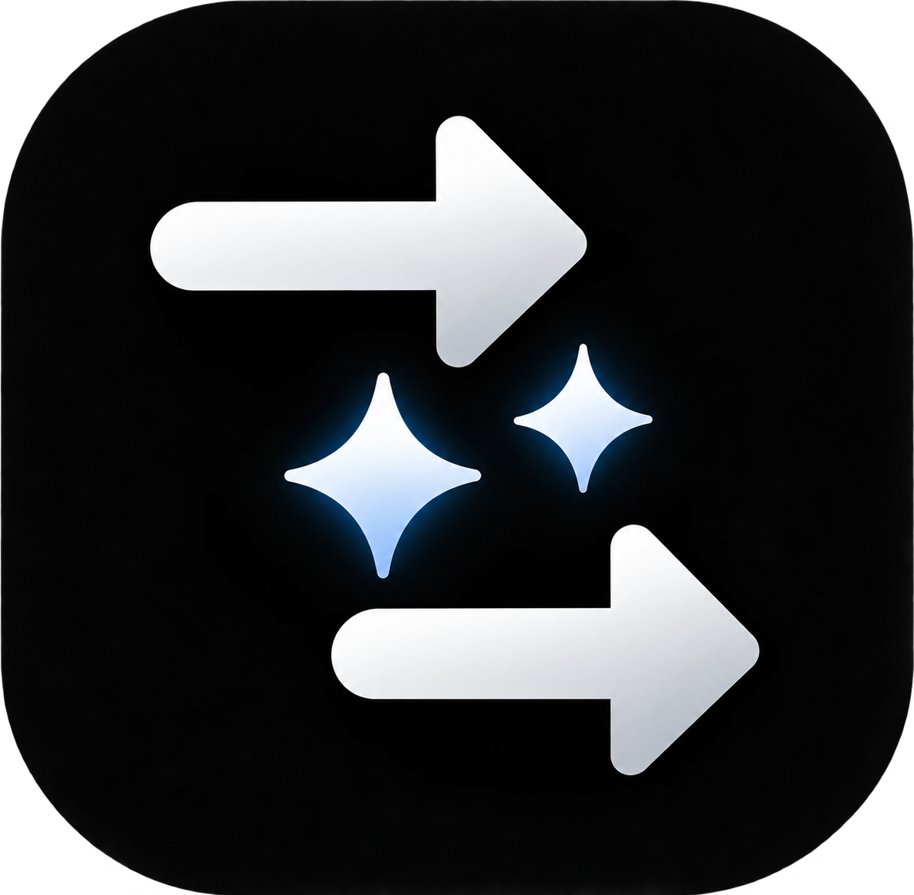
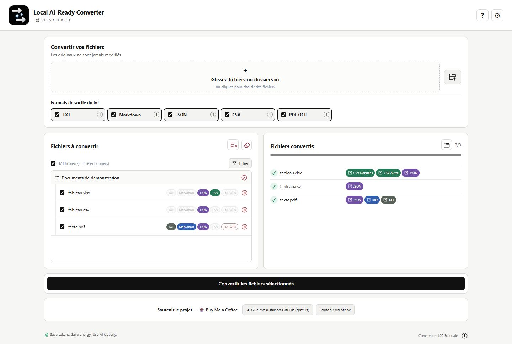

# Local AI-Ready Converter

<p align="center"></p>

<p align="center"><strong>Vos documents, convertis chez vous, en local.</strong><br>Préparez-les une fois. Choisissez ensuite comment les réutiliser.</p>

<p align="center">Local · Gratuit · Sans compte · Conversion par lot · Sans ligne de commande</p>

<p align="center"><a href="README.md">Read in English</a></p>

<p align="center">
  <a href="../../releases"></a>
  
  
</p>

> **État de publication :** ce dépôt réservé à la distribution est encore privé. Aucun installateur Windows public n'y est disponible pour l'instant. Le code source propriétaire de développement n'y sera pas publié. Linux et macOS sont prévus après Windows, mais ne sont pas encore disponibles.

## Un fichier lisible n'est pas toujours facile à réutiliser

Une facture PDF, une lettre numérisée, un rapport Word ou un classeur Excel ont d'abord été conçus pour être consultés par des humains. Un script, un outil de recherche documentaire ou un assistant IA a souvent plutôt besoin de texte extrait ou de données structurées. Local AI-Ready Converter prépare cela dans une interface de bureau : ajoutez des fichiers ou dossiers, sélectionnez les sorties compatibles, convertissez et retrouvez les résultats dans l'Explorateur. **Les originaux ne sont pas modifiés.**

Concrètement, c'est un **convertisseur local de documents : OCR des PDF et des images, PDF vers texte/Markdown/JSON, DOCX vers Markdown, XLSX vers CSV/JSON**. L'application rassemble ces opérations dans un parcours graphique de conversion par lot.

Le paquet Windows visé n'exige pas l'installation séparée de Python, Pandoc ou Tesseract. Pas besoin de compte ni de ligne de commande pour utiliser l'application. La conversion se fait sur votre ordinateur ; le contenu des documents n'est pas envoyé à un service de conversion ergoCogn.

## Découvrez l'interface



*La capture montre une vraie conversion de documents de test PDF, CSV et XLSX créés pour cet usage, dans un aperçu de l'interface. Aucun document utilisateur n'a été utilisé. [Noms et empreintes des sorties](docs/assets/conversion-demo.json). L'[aperçu À propos et soutien](docs/assets/about-demo-fr.png) montre les libellés français actuels.*

## Pourquoi préparer les documents en local ?

- **Choisir la représentation utile.** Extraire le texte d'un PDF, reconnaître un scan par OCR, produire un CSV par feuille Excel ou convertir un document Word en Markdown. Employer JSON si la structure ou les références de page comptent.
- **Réutiliser le travail.** Conserver le résultat au lieu de relancer l'extraction ou l'OCR chaque fois qu'un nouvel outil en a besoin.
- **Garder le contrôle.** Sélectionner des dossiers entiers ou des fichiers précis, filtrer par type et choisir les sorties par lot ou par fichier compatible. Les résultats restent visibles entre les conversions d'une même session.
- **Rester libre.** Utiliser les sorties avec une IA locale, une IA en ligne *si vous décidez de les lui transmettre*, un script, une base documentaire ou sans IA du tout.

L'application **prépare les documents** : elle n'embarque aujourd'hui ni modèle d'IA générative, ni recherche sémantique, ni serveur API/MCP local, ni RAG. La [feuille de route](docs/ROADMAP.md) distingue ces évolutions de ce qui fonctionne déjà.

## Des outils éprouvés, un seul parcours visuel

L'application ne prétend pas remplacer tous les convertisseurs sous-jacents. Elle les rassemble, gère les fichiers et les destinations, lance les lots et présente les résultats sans demander à chacun de manipuler ces outils séparément. **Pandoc** convertit les DOCX ; **Tesseract** et **OCRmyPDF** assurent l'OCR et les PDF recherchables ; **pypdf** extrait le texte des PDF textuels ; **openpyxl** lit les classeurs Excel. L'interface Windows utilise **pywebview et Microsoft WebView2**. Chaque composant conserve sa licence et ses conditions : voir les [composants tiers](docs/COMPOSANTS_TIERS.md).

## Téléchargement et disponibilité

| Plateforme | État |
| --- | --- |
| Windows 11 x64 | Première version publique visée ; l'installateur attend encore sa validation finale. |
| Linux | Construction et tests natifs prévus après Windows. |
| macOS | Construction et tests natifs prévus après Linux. |

Une fois validé et publié, l'installateur Windows sera disponible dans les [Releases](../../releases) de ce dépôt. Le [guide d'installation et de mise à jour](docs/INSTALLATION.md) expliquera alors l'installation graphique. **Ne confondez pas cet aperçu privé avec un téléchargement déjà publié.** Le paquet Windows prévu embarque ses outils de conversion et ses langues OCR de base : il n'exige pas qu'ils soient préinstallés.

## Convertir une fois. Réutiliser quand c'est utile.

Un PDF converti peut, par exemple, donner plusieurs vues du même document :

```text
rapport.pdf                 original, inchangé
rapport-Converted.txt       texte brut
rapport-Converted.md        Markdown
rapport-Converted.json      données structurées
```

L'application peut placer les sorties à côté de la source, dans un dossier de conversion daté ou dans une destination choisie. Si un nom existe déjà, elle numérote la nouvelle sortie au lieu d'écraser l'ancienne. Pour une source inchangée, un nouveau passage peut produire uniquement les formats supplémentaires demandés, sans répéter inutilement le même travail dans la session.

« AI-ready » signifie **préparé pour un autre outil**, et non « l'IA fonctionne dans cette application ». Vous décidez de garder les résultats en local, de les envoyer à un service ou de vous en servir sans IA. Les formats ouverts TXT, Markdown, CSV et JSON ne vous enferment pas dans ce convertisseur.

## Formats d'entrée et de sortie

| Entrée | Sorties disponibles |
| --- | --- |
| PDF textuel | TXT, Markdown, JSON ; PDF recherchable si choisi explicitement |
| PDF scanné | TXT, Markdown, JSON, PDF recherchable par OCR |
| DOCX | TXT, Markdown, JSON |
| XLSX | JSON, un CSV par feuille |
| CSV | JSON |
| PNG, JPEG, TIFF | TXT, Markdown, JSON par OCR |

TXT convient pour reprendre simplement du texte. Markdown peut garder une structure légère utile. CSV représente souvent un tableau de façon plus compacte. JSON facilite les scripts qui ont besoin de structure explicite, de métadonnées ou des limites de pages ; il peut aussi être plus verbeux qu'un CSV, surtout pour un classeur. **Aucun format ne réduit automatiquement le nombre de tokens.** Choisissez selon la tâche suivante. Voir le [guide d'utilisation](docs/UTILISATION.md) et l'[architecture](docs/ARCHITECTURE.md).

Une conversion automatique n'est pas infaillible. OCR, tableaux complexes, formules et mises en page PDF atypiques peuvent produire des omissions ou des erreurs. Vérifiez les chiffres et informations importants par rapport à l'original.

## Confidentialité : conversion locale, limites réseau explicites

La lecture, l'OCR et l'écriture des sorties ont lieu sur votre machine. Il n'est pas nécessaire de déposer factures, contrats ou rapports internes sur un site de conversion. Avec une IA locale, la source et la représentation préparée peuvent rester sur votre ordinateur.

**« Local » ne signifie pas « l'application ne se connecte jamais ».** La vérification manuelle des mises à jour, les informations publiques de l'éditeur récupérées sur GitHub, un lien de soutien ou le téléchargement demandé d'une langue OCR peuvent utiliser Internet. Le composant Windows WebView2 a aussi son propre fonctionnement. Ces fonctions ne servent pas à transmettre vos documents à un service de conversion distant. Si le dossier de sortie choisi est synchronisé par OneDrive ou un autre fournisseur, cette synchronisation est extérieure au traitement local de l'application. Lire la [page confidentialité et réseau](docs/CONFIDENTIALITE.md).

## 🍃 Save tokens. Save energy. Use AI cleverly.

C'est un principe de travail, **pas la promesse d'une économie mesurée de tokens ou d'énergie pour chaque fichier**.

**Save tokens :** envoyer un PDF entier à une API de modèle peut coûter cher en contexte. Par exemple, le [traitement des PDF par l'API d'OpenAI](https://developers.openai.com/api/docs/guides/file-inputs) peut inclure à la fois le texte extrait **et les images des pages**. Si votre question porte seulement sur les mots, envoyer à la place le TXT extrait localement — ou les seules pages utiles — peut réduire nettement le contenu traité et le coût en tokens d'entrée. Le CSV d'une seule feuille Excel peut, lui aussi, être beaucoup plus léger qu'un JSON verbeux. Gardez le PDF original lorsque les images, la mise en page ou les graphiques comptent. Le gain réel dépend du document, du modèle et de l'API ; l'application ne calcule ni ne garantit un pourcentage.

**Save energy :** conservez et réutilisez une conversion adaptée au lieu de recommencer l'extraction ou l'OCR pour chaque question. La différence sur un fichier peut être minime ; sur un ensemble traité de manière répétée, la logique devient plus intéressante. L'application ne revendique aucun bénéfice environnemental chiffré.

**Use AI cleverly :** préparez, sélectionnez ce qui est pertinent, puis utilisez l'IA adaptée à votre tâche — ou aucune. La vision à plus long terme comprend des dossiers AI-ready documentés, l'interopérabilité locale et la recherche ; ces fonctions sont [prévues, pas encore livrées](docs/ROADMAP.md). [Lire l'explication complète](docs/AI_READY.md).

## Documentation

[Installation et mises à jour](docs/INSTALLATION.md) · [Utilisation](docs/UTILISATION.md) · [Confidentialité](docs/CONFIDENTIALITE.md) · [Vision AI-ready](docs/AI_READY.md) · [Architecture](docs/ARCHITECTURE.md) · [Feuille de route](docs/ROADMAP.md) · [Notes de version](CHANGELOG.fr.md)

## Aide et soutien

Après ouverture du dépôt au public, ses [Issues](../../issues) permettront de signaler un problème ; n'y joignez jamais de document confidentiel. Vous pouvez [donner une étoile GitHub au projet](../../) gratuitement. Le soutien financier est facultatif via [Stripe](https://buy.stripe.com/8x214pgIZ7ho3vUftg1oI00) et n'est **pas** nécessaire pour utiliser l'application gratuite. Les autres boutons de paiement restent masqués tant que leurs URL ne sont pas configurées. L'espace de soutien dans l'application peut être masqué dans les Paramètres. Voir la [page soutien et annonces](docs/SOUTIEN.md).

Local AI-Ready Converter est édité par **ergoCogn sàrl**. Ce dépôt sert à la distribution des exécutables, à la documentation, aux notes de version et au suivi des problèmes ; il ne publie pas le code source propriétaire. Voir la [licence française du produit](LICENSE.fr.md), sa [traduction anglaise](LICENSE.en.md) et les [notices des composants tiers](docs/COMPOSANTS_TIERS.md). La publication publique attend encore la revue finale des licences et un test sur Windows propre.

<p align="center"><strong>Convertir une fois. Réutiliser quand c'est utile.</strong><br>🍃 Save tokens. Save energy. Use AI cleverly.</p>
