# Architecture and outlook

[Lire en français](ARCHITECTURE.md) · [Home](../README.md)

Today the app reads files on the user's computer, selects a converter by input type and writes outputs to the chosen destination. Originals are not modified. The Windows package bundles the tools it needs. The engine is mostly Python and can be reused on other platforms, but the current window and installer are Windows-specific.

```mermaid
flowchart LR
    A["PDF · DOCX · XLSX · CSV · images"] --> B["Local engine"]
    B --> C["Extraction · OCR · tables"]
    C --> D["TXT · Markdown · JSON · CSV · searchable PDF"]
    D --> E["Result folder"]

    E -. "planned" .-> F["AI-ready manifest"]
    F -. "planned" .-> G["Local API / MCP"]
    G -. "planned" .-> H["Index · retrieval · local RAG"]

    classDef current fill:#e9f5ef,stroke:#287451,color:#173f2e
    classDef future fill:#fff,stroke:#777,stroke-dasharray: 5 4,color:#555
    class A,B,C,D,E current
    class F,G,H future
```

Solid arrows are in the current product; dotted arrows are intended future work. Today's result folder is **not yet** a standardized AI-ready data format. No MCP server, semantic index or RAG is delivered in 0.3.1. See the [roadmap](ROADMAP.en.md) for order and status.
