# Fonctionnement et perspectives

Aujourd'hui, l'application lit les fichiers sur le poste, choisit un convertisseur selon le format et écrit les sorties à la destination choisie. Les originaux ne sont pas modifiés. Les outils nécessaires sont intégrés au paquet Windows.

```mermaid
flowchart LR
    A["PDF · DOCX · XLSX · CSV · images"] --> B["Moteur local"]
    B --> C["Extraction · OCR · tableaux"]
    C --> D["TXT · Markdown · JSON · CSV · PDF OCR"]
    D --> E["Dossier de résultats"]

    E -. "prévu" .-> F["Manifest AI-ready"]
    F -. "prévu" .-> G["API / MCP locale"]
    G -. "prévu" .-> H["Index · recherche · RAG local"]

    classDef actuel fill:#f5f5f5,stroke:#222,color:#111
    classDef futur fill:#fff,stroke:#777,stroke-dasharray: 5 4,color:#555
    class A,B,C,D,E actuel
    class F,G,H futur
```

Les flèches pleines représentent le produit actuel ; les flèches pointillées sont des évolutions envisagées. Le dossier de résultats d'aujourd'hui n'est **pas encore** un format AI-ready standardisé. Aucun serveur MCP, index sémantique ou RAG n'est livré dans la 0.3.1.
