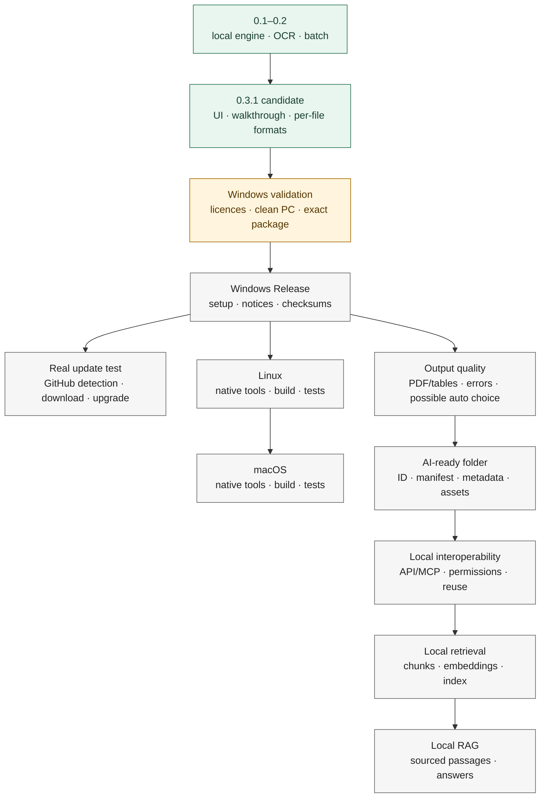

# Roadmap

[Lire en français](ROADMAP.md) · [Home](../README.md)

**Status, not a date promise.** Versions 0.1, 0.2 and 0.3 were development milestones; they do not imply that each had a public Release. The distribution repository is still private, and no public 0.3.1 installer has been published.

**Green:** existing code and tests, not a public release. **Amber:** validation in progress. **Grey:** not published or not built. After Windows, platform builds and product evolution are independent branches: AI-ready/RAG must not delay Linux and macOS.

| Stage | Actual status | Completion criterion |
| --- | --- | --- |
| **0.1–0.2 — foundation** | Conversion engine, OCR, batch handling, interface and initial destinations developed. | Historical milestones, not a current public offering. |
| **0.3 / 0.3.1 — Windows candidate** | UI, walkthrough, per-file formats, session results, configurable links, test installer and an upgrade tried on the publisher's PC. Automated tests and demo conversions run. | Still needs a clean Windows test without preinstalled tools, third-party licence/notice review and validation of the exact package. |
| **First Windows Release** | Not published. Separate private distribution repository; no proprietary source in it. | After approval only: installer, bilingual notes, required third-party notices/sources and checksums. Configure public distribution without exposing the development repository; set a concise repository description and relevant Topics. |
| **Update verification** | Version comparison, dialog and verified download tested with simulated GitHub responses; no live public Release test yet. | From an older version, detect the public Release, download the matching setup, verify size and SHA-256, reveal it in Explorer, and perform a manual upgrade. Also test “current” and offline behavior. |
| **Linux** | Python engine is largely reusable; no Linux package validated. | Build on Linux with bundled dependencies and suitable pywebview backend; test conversion/OCR and installation on a clean system. Check Linux download links and update strategy. |
| **macOS** | No macOS package validated. | Build on macOS with compatible tools; handle signing/notarization if required for the chosen distribution route; test UI and conversion/OCR on a clean machine. Verify its update route. |
| **Quality / possible 0.4 cycle** | Intended, not promised for the first Release. | Better errors, complex tables/PDFs and compact tabular JSON; define any automatic-output mode explicitly, then test its rules. |
| **AI-ready structure** | Not implemented yet. | Stable folder, document ID, versioned JSON manifest, provenance, produced files, OCR/language, source format and organized assets. |
| **Local interoperability** | Not implemented yet. | Explicit local API and/or MCP to list documents, retrieve TXT/Markdown/JSON and identify existing conversions without repeated OCR. Permissions and no default network sharing. |
| **Local retrieval** | Not implemented yet. | Source-aware chunks, local embeddings and index, semantic search tested on a corpus. |
| **Local RAG** | Not implemented yet. | Questions over documents answered with relevant retrieved passages and verifiable references; gradual integration with different agents/AIs. |

The intended path is **document → local conversion → open formats → AI-ready folder → manifest → API/MCP → chunks → embeddings/index → retrieval → RAG**. Today's dated output folder is only a destination, **not yet** the standardized AI-ready folder. Version numbers for AI-ready/RAG stages will be decided when scope and tests are defined. See the [AI-ready explanation](AI_READY.en.md) and [architecture](ARCHITECTURE.en.md).

For discoverability when the distribution repository becomes public, suggested description: “Local desktop document converter: PDF OCR, DOCX to Markdown, XLSX to CSV/JSON. Private by design; no account or command line.” Suggested Topics: `document-converter`, `pdf-ocr`, `local-first`, `batch-conversion`, `desktop-app`, `privacy`, `markdown`, `windows`. Do not use `open-source`: the application source is not published.
