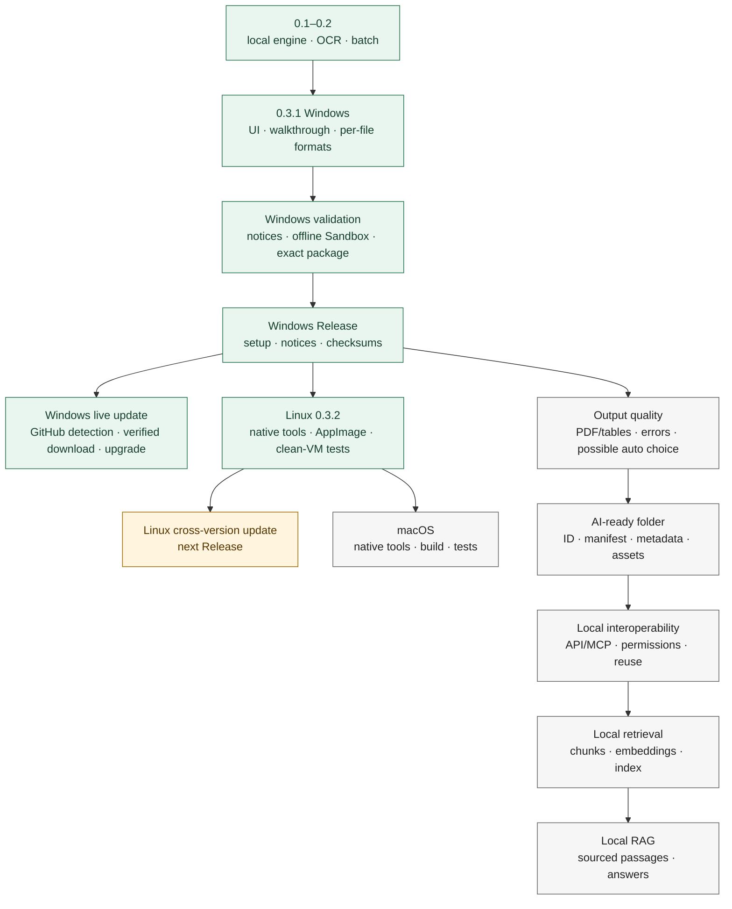

# Roadmap

[Lire en français](ROADMAP.md) · [Home](../README.md)

**Status, not a date promise.** Versions 0.1, 0.2 and 0.3 were development milestones. Windows 0.3.1 was the first public Release; version 0.3.2 is now packaged for Windows and Linux. macOS remains planned; the announced next work is output quality, then AI-ready structure and local interoperability.

**Green:** delivered and checked. **Amber:** validation in progress. **Grey:** not built yet. After the Windows and Linux platforms, the announced next work is output quality, then the AI-ready folder and local interoperability. macOS remains planned, with no announced order of passage: the port follows its own pace and does not gate that work.

| Stage | Actual status | Completion criterion |
| --- | --- | --- |
| **0.1–0.2 — foundation** | Conversion engine, OCR, batch handling, interface and initial destinations developed. | Historical milestones, not a current public offering. |
| **0.3 / 0.3.1 — Windows** | UI, walkthrough, per-file formats, session results and configurable links. Automated tests and demo conversions run. | Setup was installed, tested with conversion/OCR and uninstalled in an offline Windows Sandbox. |
| **First Windows Release** | 0.3.1 in a separate distribution repository, without proprietary source. | Installer, bilingual notes, third-party notices and sources, checksum. The development repository remains private. |
| **Update verification** | Windows completed a real upgrade from 0.3.1 to 0.3.2. Linux 0.3.2 recognizes the public Release and its exact AppImage name, size and SHA-256; offline/error cases and executable permission are covered by automated tests. | The mechanism is delivered. A live Linux upgrade between two AppImages requires the next Linux Release because no older Linux package exists. |
| **Linux 0.3.2** | Native x86_64 AppImage built with bundled tools and a static runtime; conversions, OCR, searchable PDF and the PySide6/Qt window passed on a clean Ubuntu Desktop 24.04 VM. | Published package, checksum and bilingual instructions. The download/update path is covered by automated tests and will receive a live cross-version test with the next Linux release. |
| **macOS** | No macOS package validated. Planned, with no announced order of passage. | Build on macOS with compatible tools; handle signing/notarization if required for the chosen distribution route; test UI and conversion/OCR on a clean machine. Verify its update route. |
| **Quality / possible 0.4 cycle** | Intended, not promised for the first Release. | Better errors, complex tables/PDFs and compact tabular JSON; define any automatic-output mode explicitly, then test its rules. |
| **AI-ready structure** | Not implemented yet. | Stable folder, document ID, versioned JSON manifest, provenance, produced files, OCR/language, source format and organized assets. |
| **Local interoperability** | Not implemented yet. | Explicit local API and/or MCP to list documents, retrieve TXT/Markdown/JSON and identify existing conversions without repeated OCR. Permissions and no default network sharing. |
| **Local retrieval** | Not implemented yet. | Source-aware chunks, local embeddings and index, semantic search tested on a corpus. |
| **Local RAG** | Not implemented yet. | Questions over documents answered with relevant retrieved passages and verifiable references; gradual integration with different agents/AIs. |

The intended path is **document → local conversion → open formats → AI-ready folder → manifest → API/MCP → chunks → embeddings/index → retrieval → RAG**. Today's dated output folder is only a destination, **not yet** the standardized AI-ready folder. Version numbers for AI-ready/RAG stages will be decided when scope and tests are defined. See the [AI-ready explanation](AI_READY.en.md) and [architecture](ARCHITECTURE.en.md).

For discoverability, the repository description is “Local desktop document converter: PDF OCR, DOCX to Markdown, XLSX to CSV/JSON. Private by design; no account or command line.” Topics: `document-converter`, `pdf-ocr`, `local-first`, `batch-conversion`, `desktop-app`, `privacy`, `markdown`, `json`, `tesseract`, `ocrmypdf`, `windows`, `linux`. Do not use `open-source`: the application source is not published.
