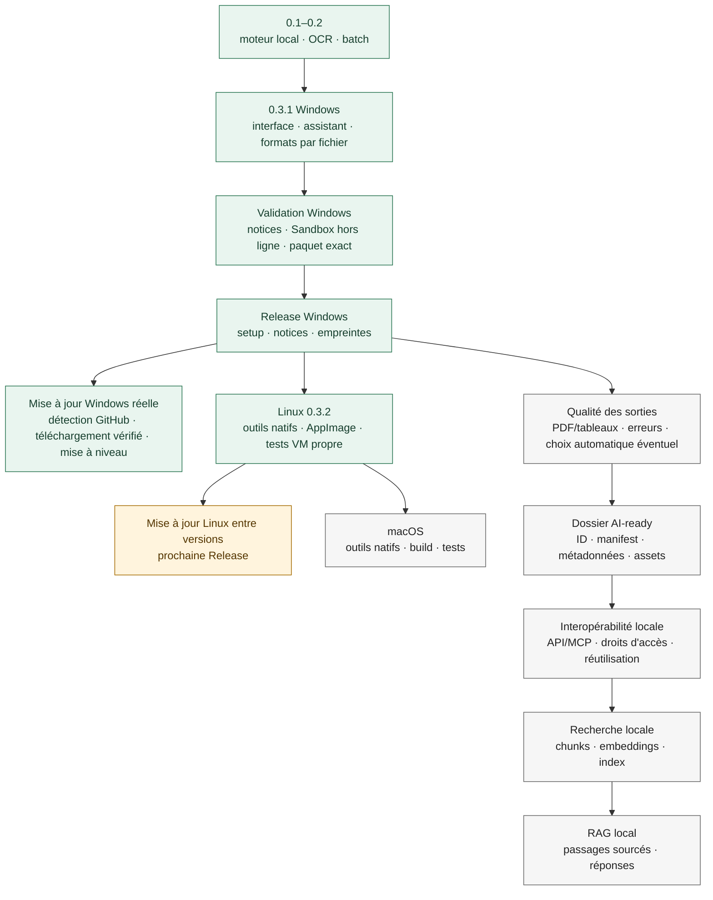

# Feuille de route

[Read in English](ROADMAP.en.md) · [Accueil](../README.fr.md)

**État, pas promesse de date.** Les numéros 0.1, 0.2 et 0.3 sont des jalons de développement. Windows 0.3.1 a été la première Release publique ; la version 0.3.2 est maintenant empaquetée pour Windows et Linux. macOS vient ensuite.

**Vert :** réalisé et vérifié. **Ambre :** validation en cours. **Gris :** pas encore réalisé. Après Windows, le portage et l'évolution fonctionnelle sont deux branches indépendantes : AI-ready/RAG ne doivent pas retarder Linux et macOS.

| Étape | État réel | Pour la considérer terminée |
| --- | --- | --- |
| **0.1–0.2 — fondation** | Moteur de conversion, OCR, batch, interface et premiers choix de destination réalisés en développement. | Jalon historique, pas une offre publique actuelle. |
| **0.3 / 0.3.1 — Windows** | Interface, assistant, formats par fichier, historique de session, liens configurables. Tests automatisés et conversions de démonstration exécutés. | Le setup a été installé, testé avec conversions/OCR et désinstallé dans Windows Sandbox hors ligne. |
| **Première Release Windows** | 0.3.1 dans le dépôt de distribution séparé, sans code propriétaire. | Installer, notes bilingues, notices et sources tierces, empreinte de contrôle. Le dépôt de développement reste privé. |
| **Vérification des mises à jour** | Windows a réalisé une vraie mise à niveau de 0.3.1 vers 0.3.2. Linux 0.3.2 reconnaît la Release publique ainsi que le nom, la taille et le SHA-256 exacts de son AppImage ; les erreurs/hors-ligne et le droit d'exécution sont couverts par les tests automatisés. | Le mécanisme est livré. Une vraie mise à niveau Linux entre deux AppImages exige la prochaine Release Linux, puisqu'il n'existe aucun paquet Linux antérieur. |
| **Linux 0.3.2** | AppImage x86_64 native construite avec outils intégrés et runtime statique ; conversions, OCR, PDF recherchable et fenêtre PySide6/Qt validés sur une VM Ubuntu Desktop 24.04 propre. | Paquet publié, empreinte et instructions bilingues. Le téléchargement/mise à jour est couvert par les tests automatisés ; un essai réel entre deux versions Linux sera fait à la prochaine Release. |
| **macOS** | Aucun paquet macOS validé. | Construire sur macOS avec outils compatibles, signature/notarisation si nécessaires au mode de distribution retenu, interface et conversions/OCR testées sur machine propre. Vérifier sa méthode de mise à jour. |
| **Qualité / futur cycle 0.4** | Envisagé, non promis pour la première Release. | Mieux guider les erreurs, améliorer tableaux/PDF complexes et JSON tabulaire compact, expliciter un éventuel mode de choix automatique des sorties, puis tester chaque règle. |
| **Structure AI-ready** | Pas encore implémentée. | Dossier stable, identifiant de document, manifest JSON versionné, provenance, sorties produites, OCR/langue, format source et organisation des assets. |
| **Interopérabilité locale** | Pas encore implémentée. | API et/ou MCP activés explicitement pour lister les documents, récupérer TXT/Markdown/JSON et connaître les conversions déjà faites, sans OCR répété. Permissions et aucun partage réseau par défaut. |
| **Recherche locale** | Pas encore implémentée. | Découpage en passages avec références de source, embeddings et index locaux, recherche sémantique testée sur un corpus. |
| **RAG local** | Pas encore implémenté. | Questions sur les documents avec passages pertinents retrouvés et références vérifiables ; intégration progressive à différents agents/IA. |

Le parcours visé est **document → conversion locale → formats ouverts → dossier AI-ready → manifest → API/MCP → passages → embeddings/index → recherche → RAG**. Le dossier daté actuel est seulement une destination, **pas encore** le dossier AI-ready standardisé. Les numéros des étapes AI-ready/RAG seront fixés lorsque leur périmètre et leurs tests seront définis. Voir l'[explication AI-ready](AI_READY.md) et l'[architecture](ARCHITECTURE.md).

Pour la découvrabilité, description du dépôt : « Local desktop document converter: PDF OCR, DOCX to Markdown, XLSX to CSV/JSON. Private by design; no account or command line. » Topics : `document-converter`, `pdf-ocr`, `local-first`, `batch-conversion`, `desktop-app`, `privacy`, `markdown`, `json`, `tesseract`, `ocrmypdf`, `windows`, `linux`. Ne pas utiliser `open-source` : le code de l'application n'est pas publié.
