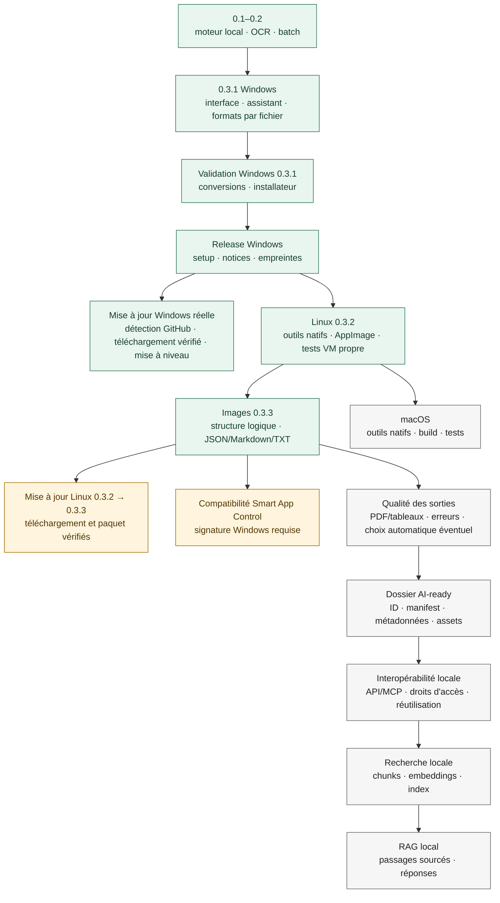

# Feuille de route

[Read in English](ROADMAP.en.md) · [Accueil](../README.fr.md)

**État, pas promesse de date.** Les numéros 0.1, 0.2 et 0.3 sont des jalons de développement. Windows 0.3.1 a été la première Release publique ; la version 0.3.3 est publiée pour Windows et Linux. Elle améliore la structure des conversions d'images. macOS reste prévu ; les prochains chantiers annoncés sont la qualité des sorties, puis la structure AI-ready et l'interopérabilité locale.

```mermaid
flowchart TB
  A["0.1–0.2<br/>moteur local · OCR · batch"] --> B["0.3.1 Windows<br/>interface · assistant · formats par fichier"]
  B --> C["Validation Windows 0.3.1<br/>conversions · installateur"]
  C --> D["Release Windows<br/>setup · notices · empreintes"]
  D --> U["Mise à jour Windows réelle<br/>détection GitHub · téléchargement vérifié · mise à niveau"]

  D --> L["Linux 0.3.2<br/>outils natifs · AppImage · tests VM propre"] --> S["Images 0.3.3<br/>structure logique · JSON/Markdown/TXT"]
  S --> UL["Mise à jour Linux 0.3.2 → 0.3.3<br/>téléchargement et paquet vérifiés"]
  S --> W["Compatibilité Smart App Control<br/>signature Windows requise"]
  L --> M["macOS<br/>outils natifs · build · tests"]
  S --> Q["Qualité des sorties<br/>PDF/tableaux · erreurs · choix automatique éventuel"]
  Q --> F["Dossier AI-ready<br/>ID · manifest · métadonnées · assets"]
  F --> P["Interopérabilité locale<br/>API/MCP · droits d'accès · réutilisation"]
  P --> K["Recherche locale<br/>chunks · embeddings · index"] --> R["RAG local<br/>passages sourcés · réponses"]

  classDef fait fill:#e9f5ef,stroke:#287451,color:#173f2e
  classDef enCours fill:#fff4dd,stroke:#a56b00,color:#553600
  classDef futur fill:#f6f6f6,stroke:#666,color:#222
  class A,B,C,D,U,L,S fait
  class UL,W enCours
  class M,Q,F,P,K,R futur
```

**Vert :** réalisé et vérifié. **Ambre :** validation en cours. **Gris :** pas encore réalisé. Après les plateformes Windows et Linux, les prochains chantiers annoncés sont la qualité des sorties, puis le dossier AI-ready et l'interopérabilité locale. macOS reste prévu, sans ordre de passage annoncé : le portage suit son propre rythme et ne conditionne pas ces chantiers.

| Étape | État réel | Pour la considérer terminée |
| --- | --- | --- |
| **0.1–0.2 — fondation** | Moteur de conversion, OCR, batch, interface et premiers choix de destination réalisés en développement. | Jalon historique, pas une offre publique actuelle. |
| **0.3 / 0.3.1 — Windows** | Interface, assistant, formats par fichier, historique de session, liens configurables. | Première version Windows publiée avec installateur et conversions/OCR vérifiées. |
| **Première Release Windows** | 0.3.1 dans le dépôt de distribution séparé, sans code propriétaire. | Installer, notes bilingues, notices et sources tierces, empreinte de contrôle. Le dépôt de développement reste privé. |
| **Vérification des mises à jour** | Windows a réalisé des mises à niveau de 0.3.1 vers 0.3.2 et de 0.3.2 vers 0.3.3. Sous Linux, le code de 0.3.2 a détecté et téléchargé la Release 0.3.3 publique avec contrôle de l'empreinte ; le paquet téléchargé a démarré et passé ses diagnostics. | Le mécanisme est livré. Le parcours graphique complet de mise à jour Linux reste à vérifier. |
| **Linux 0.3.2–0.3.3** | AppImages x86_64 natives publiées. Conversions, OCR, PDF recherchable et fenêtre PySide6/Qt validés sur Ubuntu Desktop 24.04 ; le paquet 0.3.3 téléchargé a passé les vérifications du paquet et de l'interface. | Paquets, empreintes et instructions bilingues publiés. |
| **Images 0.3.3 — structure logique** | JSON générique en blocs ordonnés pour les titres, listes, associations libellé/valeur, contrôles sélectionnés et tableaux clairement délimités ; Markdown et TXT bénéficient de cette structure. Repli sur le texte OCR lorsque la structure est incertaine. | Livré pour Windows et Linux. CSV conserve son comportement existant : aucune structure tabulaire n'est inventée pour une image non tabulaire. |
| **Compatibilité Windows Smart App Control** | Les setups publics 0.3.2 et 0.3.3 sont non signés et peuvent être bloqués par cette protection avant leur lancement. Le setup 0.3.3 a réussi une mise à niveau et une installation neuve sur un Windows qui l'autorise. | Obtenir une signature de code valide, signer le paquet Windows et valider le setup final sur un système appliquant cette protection avant d'annoncer cette compatibilité. |
| **macOS** | Aucun paquet macOS validé. Prévu, sans ordre de passage annoncé. | Construire sur macOS avec outils compatibles, signature/notarisation si nécessaires au mode de distribution retenu, interface et conversions/OCR testées sur machine propre. Vérifier sa méthode de mise à jour. |
| **Qualité / futur cycle 0.4** | Envisagé, non promis pour la première Release. | Mieux guider les erreurs, améliorer tableaux/PDF complexes et JSON tabulaire compact, expliciter un éventuel mode de choix automatique des sorties, puis tester chaque règle. |
| **Structure AI-ready** | Pas encore implémentée. | Dossier stable, identifiant de document, manifest JSON versionné, provenance, sorties produites, OCR/langue, format source et organisation des assets. |
| **Interopérabilité locale** | Pas encore implémentée. | API et/ou MCP activés explicitement pour lister les documents, récupérer TXT/Markdown/JSON et connaître les conversions déjà faites, sans OCR répété. Permissions et aucun partage réseau par défaut. |
| **Recherche locale** | Pas encore implémentée. | Découpage en passages avec références de source, embeddings et index locaux, recherche sémantique testée sur un corpus. |
| **RAG local** | Pas encore implémenté. | Questions sur les documents avec passages pertinents retrouvés et références vérifiables ; intégration progressive à différents agents/IA. |

Le parcours visé est **document → conversion locale → formats ouverts → dossier AI-ready → manifest → API/MCP → passages → embeddings/index → recherche → RAG**. Le dossier daté actuel est seulement une destination, **pas encore** le dossier AI-ready standardisé. Les numéros des étapes AI-ready/RAG seront fixés lorsque leur périmètre et leurs tests seront définis. Voir l'[explication AI-ready](AI_READY.md) et l'[architecture](ARCHITECTURE.md).

Pour la découvrabilité, description du dépôt : « Local desktop document converter: PDF OCR, DOCX to Markdown, XLSX to CSV/JSON. Private by design; no account or command line. » Topics : `document-converter`, `pdf-ocr`, `local-first`, `batch-conversion`, `desktop-app`, `privacy`, `markdown`, `json`, `tesseract`, `ocrmypdf`, `windows`, `linux`. Ne pas utiliser `open-source` : le code de l'application n'est pas publié.
