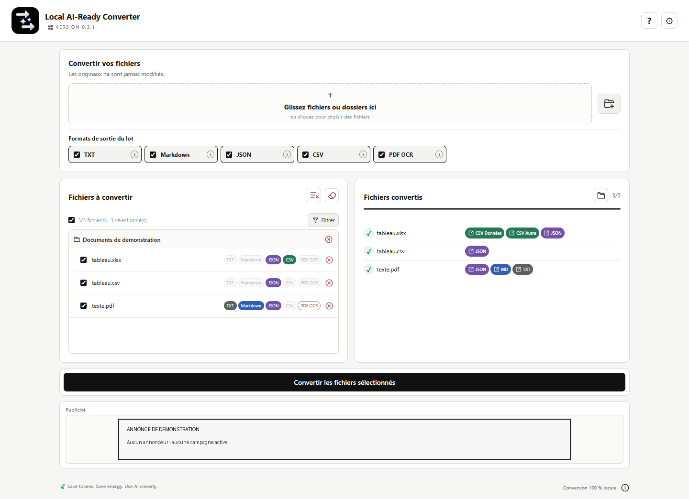

# Soutien et annonces dans l'application

Local AI-Ready Converter peut montrer un espace « Soutenir le projet » sur l'écran principal. L'étoile GitHub est un geste **gratuit**, distinct d'une contribution financière. Si ergoCogn active des liens de soutien, les boutons correspondants ouvrent la page du prestataire dans votre navigateur ; l'application ne traite pas elle-même les paiements. Aucun montant n'est présumé par l'application : seul un bouton explicitement libellé avec un montant et relié à une page correspondante devrait le suggérer.

Si une véritable annonce est configurée, elle remplace cette carte dans le même emplacement et porte la mention « Publicité ». L'annonce est une image incluse dans la version installée, associée à un lien HTTPS. L'application ne charge pas une régie publicitaire, un script ou une image depuis un serveur à chaque affichage. Un clic ouvre le lien dans le navigateur. Changer l'image ou sa destination nécessite une nouvelle version de l'application.

*Illustration seulement : visuel créé pour une démonstration, sans campagne ni annonceur réel.*

La visite guidée et les Paramètres permettent de masquer tout cet espace. Ce choix est conservé localement sur l'ordinateur. La conversion reste utilisable avec ou sans cet espace. Les informations concernant les accès réseau facultatifs et le runtime Windows sont détaillées dans la [note de confidentialité](CONFIDENTIALITE.md).
